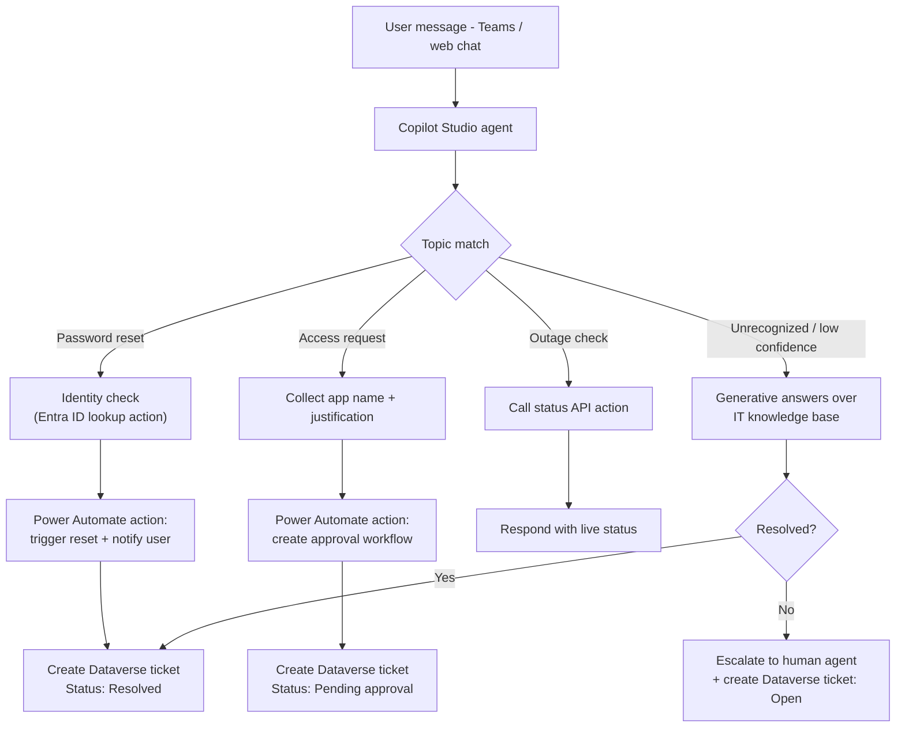

# Copilot Studio Agent — IT Helpdesk

A portfolio reference build for a Microsoft Copilot Studio conversational agent that handles common IT helpdesk requests (password resets, access requests, "is it just me" outage checks) and hands off to a human when it can't resolve something, logging every conversation as a ticket.

Note: this repo documents the agent's topic design, actions and escalation logic used in similar client builds (see my Upwork profile). It's a rebuilt reference version for demonstration — topic names, phrases and data shown are sample content, not a real client's agent.

## Problem

A large share of helpdesk tickets are repetitive, well-defined requests (password reset, software access, VPN issues) that don't need a person to triage — but users still expect a fast, conversational way to ask, get a ticket number, or get escalated when the request is unusual.

## Architecture

## How it works

1. Topics: purpose-built topics for the highest-volume request types (password reset, software/access requests, VPN/connectivity issues, "check system status"), each with trigger phrases and a guided slot-filling conversation.
2. Identity-aware actions: the password-reset topic calls a Power Automate flow that looks up the user's identity (via connector) before taking any action, rather than trusting free-text input.
3. Approvals where needed: access requests don't self-approve — the agent collects the request, then a Power Automate flow starts an approval with the resource owner and the agent replies with a ticket number, not an immediate grant.
4. Fallback to generative answers: anything outside the built topics is handled by generative answers grounded on an IT knowledge base (SharePoint/Dataverse source), so the agent still helps instead of dead-ending.
5. Escalation: when confidence is low or the user asks for a person, the agent hands off to a live-agent queue and still logs a ticket so nothing is lost in the handoff.
6. Every interaction becomes a Dataverse ticket record (topic, resolution status, transcript link) so IT has the same reporting they'd get from a traditional ticketing tool.

## Design choices that matter

- Action-gated, not just chat — anything that changes a system of record goes through an authenticated Power Automate action, never a raw LLM response.
- Approvals stay approvals — the agent collects and routes access requests; it doesn't grant access itself.
- Every conversation is logged as a ticket, resolved or escalated, so nothing disappears into chat history.

## Tech stack

- Microsoft Copilot Studio (topics, entities, generative answers)
- Power Automate (identity lookup, reset, approval and ticketing actions)
- Microsoft Dataverse (ticket table)
- Microsoft Teams channel

## Repository contents

- [`topics/`](topics) — reference Copilot Studio topic definitions (password reset, access request, outage check).
- [`flows/`](flows) — the two supporting Power Automate actions the topics call into.
- [`dataverse/`](dataverse) — the ticket table schema.

## About

Built by Poorani R., Power Automate / RPA developer. See more automation projects on my Upwork profile (https://www.upwork.com/freelancers/~017d8cafb3f856e3f4) and other repos in this GitHub profile.
